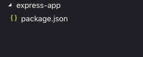

# Create Express Application
Create a directory to save express project
```
   $ mkdir ~/projects/express_app
   $ cd ~/projects/express_app
```
Run the following command to create a new NodeJS projet
```
    npm init
```
This command will asks you to enter the application name and many other information. Just click enter.
When finished process, It show you an folder structure like this. 



# Installing express
Now, it´s time to install express library in your project
```
    npm install express --save
```

# Starting to code
Create an app.js file in your root directory
```
    $touch app.js
```
Copy and paste the following code inside the app.js file
```javascript
    const express = require('express')
    const app = express()

    app.get('/', (req, res) => res.send('Hello world!'))

    const port = process.env.PORT || 3011

    app.listen(port, () => 
    console.log(`App is listening on port ${port}.`)
    )
```
**Creating more endpoints in express**
```javascript
    app.get('/:name', function(req, res){
        res.send('Req params: ' + req.params.name);
    });

    app.post('/:name', function (req, res) {
        res.send('Got a POST request');
    });

    app.put('/:name', function (req, res) {
        res.send('Got a PUT request');
    });

    app.delete('/:name', function (req, res) {
        res.send('Got a DELETE request');
    });
```
## Run node app in local mode
Now, You can run this file with the following command
```
   $ node app.js
```
**Examples and documentation**
 - https://expressjs.com/en/starter/hello-world.html
 - https://expressjs.com/en/starter/basic-routing.html

---
# Setting a node-express application to run in AWS Lambda
In order to use Claudia.js to deploy on AWS Lambda, you need slightly to modify the code in app.js. Instead of staring the server using app.listen, you should export your app. After these modification, your app.js file should look like the following:
```javascript
    const express = require('express')
    const app = express()

    app.get('/', (req, res) => res.send('Hello world!'))

    module.exports = app;
```
Creating another file called **app.local.js** with the following content:
```javascript
    const app = require('./app')
    const port = process.env.PORT || 3000

    app.listen(port, () => 
    console.log(`App is listening on port ${port}.`)
    )
```
**Well done, Now we have a very basic project based on node and express**

# Run Node and Express in AWS Lambda
In this part we need to install [Claudia.js](https://claudiajs.com/). It makes super simple to deploy Node.js apps on AWS Lambda and API Gateway
Install Claudia.js library
```
    $ npm install -g claudia
```
You need to generate AWS Lambda wrapper for your Express app to make that your app work correctly on AWS Lambda. Using Claudia, you can do so by running the following command:
```
    $ claudia generate-serverless-express-proxy --express-module app
```
*app is the name of your main file app.js*
Above command will generate a lambda.js file in your app root directory with the following content:
```javascript
    'use strict'
    const awsServerlessExpress = require('aws-serverless-express')
    const app = require('./index')
    const binaryMimeTypes = [
        'application/octet-stream',
        'font/eot',
        'font/opentype',
        'font/otf',
        'image/jpeg',
        'image/png',
        'image/svg+xml'
    ]
    const server = awsServerlessExpress.createServer(app, null, binaryMimeTypes);
    exports.handler = (event, context) => awsServerlessExpress.proxy(server, event, context)
```
That's it. Now you just need to deploy your Express app (with lambda.js file) to AWS Lambda and API Gateway using the the command:
```
    $ claudia create --handler lambda.handler --deploy-proxy-api --region us-east-1
```
If everything goes well, the above command will finish after a few moments and will print the following response:
```
    {
    "lambda": {
        "role": "express-app-executor",
        "name": "express-app",
        "region": "us-east-1"
    },
    "api": {
        "id": "2yfnh84gcj",
        "url": "https://joxpcjx0j4.execute-api.us-east-1.amazonaws.com/latest"
    }
    }
```
In future, if you want to change your app code (i.e. add more routes), you can deploy those changes to AWS Lambda with the following command:
```
    $ claudia update
```
---
# Add dependencies
```shell
    npm install passport --save
    npm install passport-facebook --save
    npm install passport-github2 --save
    npm install passport-twitter --save
```